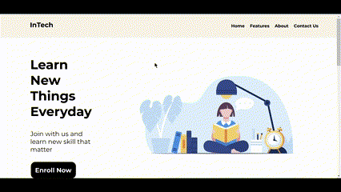

# OIBSIP
Internship with awesome projects
# Level 1

### Task 1
In this task I've to create a **Landing Page** with Beautiful Layout using HTML and CSS. A landing page is one of the best web development projects for beginners.

### Task 2
In this task I've to create a **Personal Portfolio** with HTML and CSS. In personal portfolio, I've to show a wide range of samples and skills.

### Task 3
In this task I've to create a **Temperature Converter** with HTML, CSS and JS. It convert temperature Degree to Fahrenheit or Kelvin and vice versa.

This is link to [Github](https://github.com/Itsb4) and [LinkedIn](https://www.linkedin.com/in/itsshubh/)
